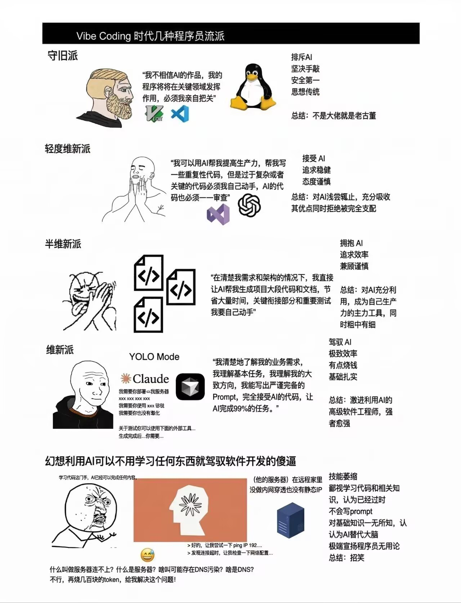

# claude-project-template

在 AI 辅助开发中沉淀的可复用项目模板。基于工作习惯优先于代码质量的理念，本项目的目标是让你的豆包像 Claude Opus 一样工作。

## 对谁有用？

模板的目的在于把工程思维翻译成机械可执行的约束。补全观念上的短板后，较差的模型也能在某些工作上追平顶级模型。

| 效果 | 代表模型 | 说明 |
|------|----------|------|
| 基本没用 | Claude Opus 4.6+、GPT-5.5+ | 模型自己能做出好判断 |
| 改善明显 | Claude Sonnet 4.6、GLM-5.1、DeepSeek-V4 | 孺子可教 |
| 心理安慰 | DeepSeek-V3、豆包手机版，及以下 | 主观判断力不够 |

*评价时参考了 [LMArena](https://arena.ai/leaderboard/agent)。

另外这套方案更适合对古法非遗开发有所了解的人。模板能把你的工程标准翻译成 AI 能执行的规则，但前提是你有“你的工程标准”：

| 效果 | 代表人群 | 说明 |
|------|------|------|
| 改善明显 | 掌握古法开发 | 守旧派到维新派都适用。你有判断力，有清晰prompt |
| 基本没用 | 许愿式开发者 | 被欺上瞒下的 AI 架空。较差模型对外行 Vibe Coding 极不友好，请充钱给 Fable 5 |

<!---->

## 包含内容

- **CLAUDE.md 模板** —— 预置占位符（技术栈、命令、目录结构、工作流），填入项目信息即可使用；同时包含「回答质量约束」章节（事实/推论分隔、工具失败降级、信源选择规则），无需额外配置
- **engineering-mindset skill** —— Google 级 code review 标准的工程思维规范，要求 AI 以清晰性优先、推断意图、拒绝过度工程、不自作主张扩大范围

## 使用方法

1. 将本仓库复制到新项目根目录：

```bash
git clone git@github.com:KaleidScoper/claude-project-template.git my-new-project
rm -rf my-new-project/.git
```

2. 编辑 `CLAUDE.md`，取消各占位符的注释并填入项目实际信息
3. 如果项目有专属设计语言或额外规范，在 `.claude/skills/` 下添加对应 skill
4. 视情况在 `.claude/settings.local.json` 中配置权限

或：

1. 只复制你需要的部分
2. 享受您的生活和 Agent 的高质量回复

## 维护原则

本模板只收录**跨项目通用**的约束和规范。与特定项目绑定的内容（如博客设计语言、某个框架的配置）不应进入此模板。